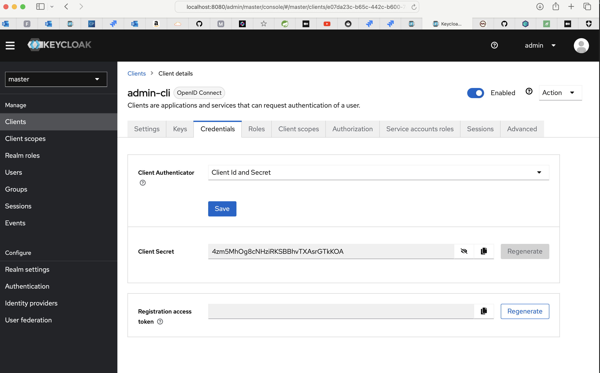

Sure, here's a basic `KEYCLOAK-SECRET-README.md` file that explains how to extract the `admin-cli` client secret from a running Keycloak installation.

# Extracting Keycloak Client Secret

This guide will walk you through the process of extracting the `admin-cli` client secret from a running Keycloak installation.

## Pre-requisites

Ensure you have the following:

- A running Keycloak instance.
- Admin access to the Keycloak instance.

## Steps

### Step 1 - Login to Keycloak Admin Console

Open your web browser and navigate to the Keycloak admin console. The URL is typically in the format `http://<keycloak-server-url>` locally it should be `http://localhost:8080`. Use your admin credentials to log in.

### Step 2 - Select the Realm

In the Keycloak admin console, select the appropriate realm from the dropdown in the top-left corner. If you're using the `master` realm, select `master`.

### Step 3 - Navigate to Clients

In the left-hand menu, click on `Clients`. This will display a list of clients configured for the selected realm.

### Step 4 - Select the `admin-cli` Client

From the list of clients, click on `admin-cli`. This will open the settings for the `admin-cli` client.

### Step 5 - Navigate to Credentials

In the `admin-cli` client settings, click on the `Credentials` tab. This will display the client credentials.

### Step 6 - Copy the Secret

In the `Credentials` tab, you will see a field labeled `Secret`. This is the client secret for the `admin-cli` client. Click on the copy button next to the secret to copy it to your clipboard.

## Conclusion

You have now extracted the `admin-cli` client secret from a running Keycloak installation. You can use this secret to authenticate as the `admin-cli` client in Keycloak.

Please note that the client secret is sensitive information. Be sure to handle it securely and do not share it with unauthorized individuals.

Please replace `<your-email>@<email-provider>.com` and `<license>` with your actual email and the license your project uses.